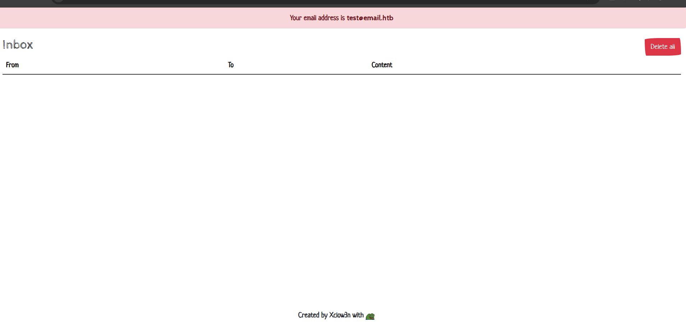
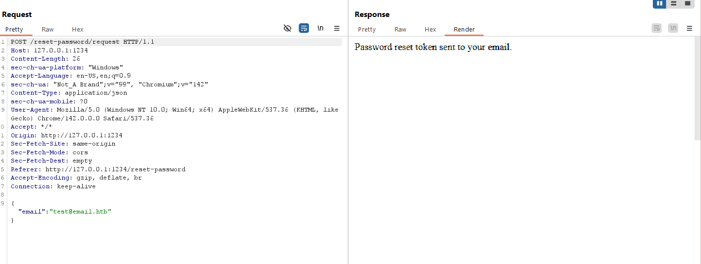
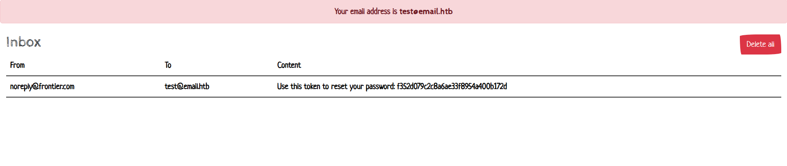
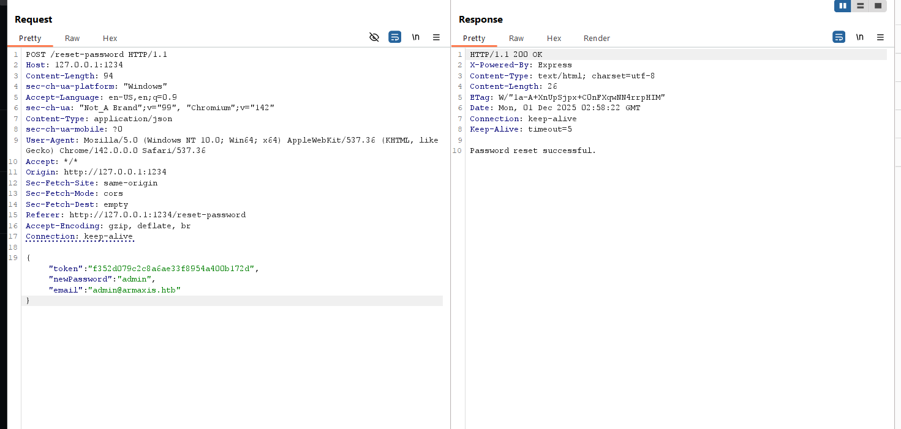
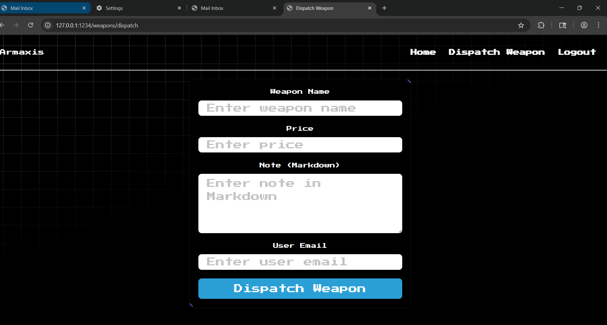

Armaxis
========

## Challenge Description

In the depths of the Frontier, Armaxis powers the enemy’s dominance, dispatching weapons to crush rebellion. Fortified and hidden, it controls vital supply chains. Yet, a flaw whispers of opportunity, a crack to expose its secrets and disrupt their p

## Solution

The challenge exposes two web interfaces:

- The main Armaxis banking application  
- A separate “email-app” interface

  


### 1. Discovering the Markdown Processing Vulnerability

Reviewing the source code, we find a `markdown.js` file used to render Markdown content:
```js
const MarkdownIt = require('markdown-it');
const { execSync } = require('child_process');

const md = new MarkdownIt({
    html: true,
});

function parseMarkdown(content) {
    if (!content) return '';
    return md.render(
        content.replace(/\!\[.*?\]\((.*?)\)/g, (match, url) => {
            try {
                const fileContent = execSync(`curl -s ${url}`);
                const base64Content = Buffer.from(fileContent).toString('base64');
                return ``;
            } catch (err) {
                console.error(`Error fetching image from URL ${url}:`, err.message);
                return `<p>Error loading image: ${url}</p>`;
            }
        })
    );
}

module.exports = { parseMarkdown };
```

The `parseMarkdown(content)` function processes Markdown input, converting image links (``) into HTML `` tags. The image content is fetched using `curl` and embedded as a Base64-encoded string. However, the `url` parameter is passed directly to `execSync` without sanitization, leading to a Remote Code Execution (RCE) vulnerability.

### 2. Identifying the Endpoint Using `parseMarkdown`

The `parseMarkdown` function is utilized in the following endpoint in `routes/index.js`:
```js
router.post("/weapons/dispatch", authenticate, async (req, res) => {
  const { role } = req.user;
  if (role !== "admin") return res.status(403).send("Access denied.");

  const { name, price, note, dispatched_to } = req.body;
  if (!name || !price || !note || !dispatched_to) {
    return res.status(400).send("All fields are required.");
  }

  try {
    const parsedNote = parseMarkdown(note);

    await dispatchWeapon(name, price, parsedNote, dispatched_to);

    res.send("Weapon dispatched successfully.");
  } catch (err) {
    console.error("Error dispatching weapon:", err);
    res.status(500).send("Error dispatching weapon.");
  }
});
```

The `/weapons/dispatch` endpoint processes the `note` field using `parseMarkdown`. However, access to this endpoint requires an `admin` role.

### 3. Gaining Admin Access

The database contains an admin account with a randomly generated password:
```js
await runInsertUser(
    "admin@armaxis.htb",
    `${crypto.randomBytes(69).toString("hex")}`,
    "admin",
);
```

To gain access, we exploit the password reset functionality.

#### Password Reset Endpoints

The application provides the following endpoints for password reset:
```js
router.post("/reset-password/request", async (req, res) => {
  const { email } = req.body;
  if (!email) return res.status(400).send("Email is required.");

  try {
    const user = await getUserByEmail(email);
    if (!user) return res.status(404).send("User not found.");

    const resetToken = crypto.randomBytes(16).toString("hex");
    const expiresAt = Date.now() + 3600000;

    await createPasswordReset(user.id, resetToken, expiresAt);

    await transporter.sendMail({
      from: "noreply@frontier.com",
      to: email,
      subject: "Password Reset",
      text: `Use this token to reset your password: ${resetToken}`,
    });

    res.send("Password reset token sent to your email.");
  } catch (err) {
    console.error("Error processing reset request:", err);
    res.status(500).send("Error processing reset request.");
  }
});

router.post("/reset-password", async (req, res) => {
  const { token, newPassword, email } = req.body;
  if (!token || !newPassword || !email)
    return res.status(400).send("Token, email, and new password are required.");

  try {
    const reset = await getPasswordReset(token);
    if (!reset) return res.status(400).send("Invalid or expired token.");

    const user = await getUserByEmail(email);
    if (!user) return res.status(404).send("User not found.");

    await updateUserPassword(user.id, newPassword);
    await deletePasswordReset(token);

    res.send("Password reset successful.");
  } catch (err) {
    console.error("Error resetting password:", err);
    res.status(500).send("Error resetting password.");
  }
});
```

1. `/reset-password/request`: Sends a reset token to the provided email. The token is stored in the database with the user ID and expiration time.
2. `/reset-password`: Resets the password using the token, new password, and email. However, the server does not verify if the token belongs to the specified user.

#### Exploiting the Password Reset

1. Create a new account using the email `test@email.htb` (provided in the email-app).
2. Request a password reset for this account:
     
   
3. Use the received token to reset the password for the admin account (`admin@armaxis.htb`):
   
4. Successfully log in as the admin:
   

### 4. Exploiting the RCE Vulnerability

With admin access, we can exploit the RCE vulnerability in the `/weapons/dispatch` endpoint by crafting a malicious `note` field:
   

The payload is successfully executed, and the result is visible in the `/weapons` interface:
     
   

Decoding the Base64 string reveals the flag.