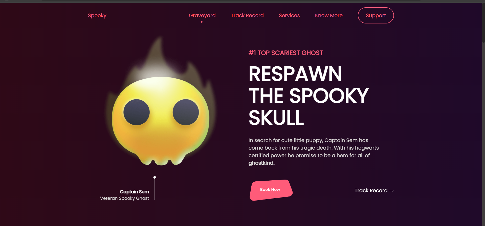
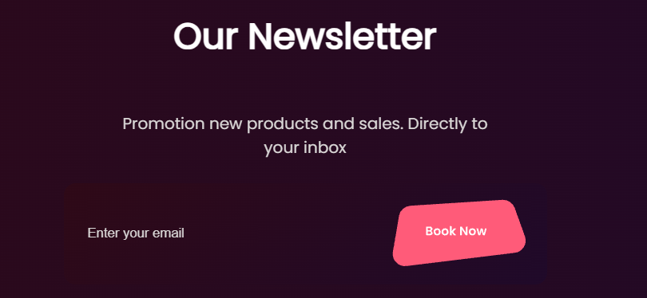
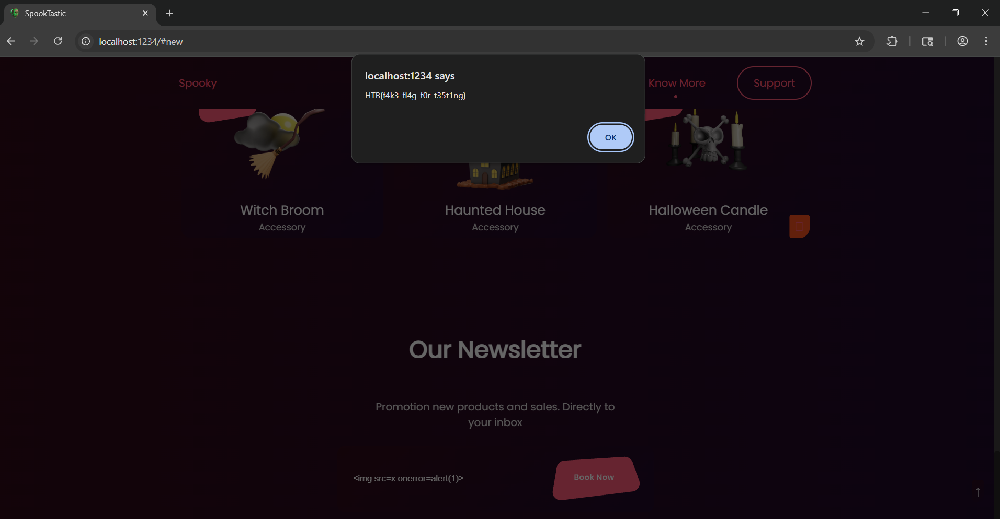

SpookTastic

# Solution

- The homepage has a nice Halloween-themed interface and an input field to submit an email.



- Since the challenge provides the source code, we start by reviewing it.

`app.js` (relevant part):
```js
// PREVIOUS PART ...

generate = lambda x: "".join([random.choice(string.hexdigits) for _ in range(x)])
BOT_TOKEN = generate(16)

def blacklist_pass(email):
    email = email.lower()

    if "script" in email:
        return False

    return True


def send_flag(user_ip):
    for id, ip in socket_clients.items():
        if ip == user_ip:
            socketio.emit("flag", {"flag": open("flag.txt").read()}, room=id)


def start_bot(user_ip):
  //PREVIOUS PART....
    service = Service(executable_path="/usr/bin/chromedriver")
    browser = webdriver.Chrome(service=service, options=options)

    try:
        browser.get(f"{HOST}/bot?token={BOT_TOKEN}")

        WebDriverWait(browser, 3).until(EC.alert_is_present())

        alert = browser.switch_to.alert
        alert.accept()
        send_flag(user_ip)
    except Exception as e:
        pass
    finally:
        registered_emails.clear()
        browser.quit()


@app.route("/api/register", methods=["POST"])
def register():
    if not request.is_json or not request.json["email"]:
        return abort(400)
    
    if not blacklist_pass(request.json["email"]):
        return abort(401)

    registered_emails.append(request.json["email"])
    Thread(target=start_bot, args=(request.remote_addr,)).start()
    return {"success":True}


@app.route("/bot")
def bot():
    if request.args.get("token", "") != BOT_TOKEN:
        return abort(404)
    return render_template("bot.html", emails=registered_emails)


```
- Our goal is to trigger the `send_flag()` function. To do this, we need to activate the alert event `WebDriverWait(browser, 3).until(EC.alert_is_present())` on the webpage the bot visits after we submit an email.

- Reviewing `bot.html`, we see that XSS is possible through the email field:
```html

    <span>{{ email|safe }}</span><br/>

```
- The `|safe` filter means the input is not escaped.

- Knowing that XSS is possible through the email field, we need to bypass the `blacklist_pass` function:
    - It converts the email to lowercase.
    - It fails if "script" is present in the email. This filter is simple and can be bypassed easily, for example, using an `img` tag with an `onerror` attribute.

```html

```
- Using this payload, we get the flag.
