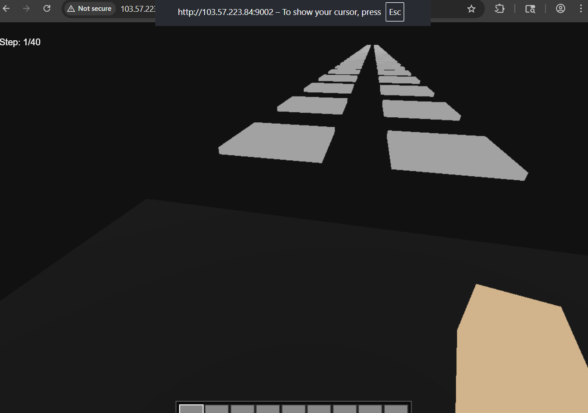
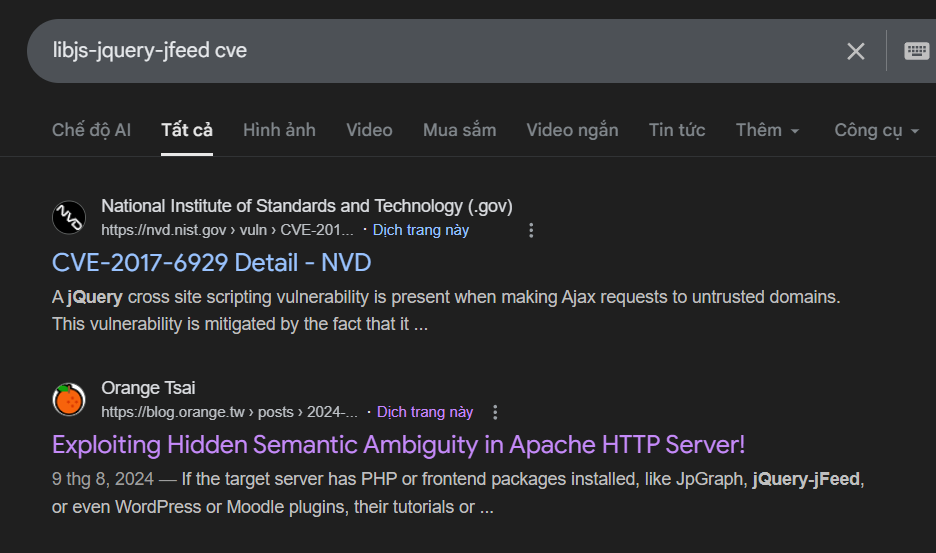
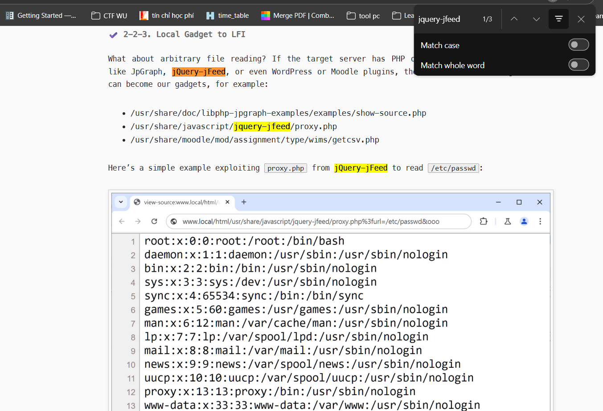
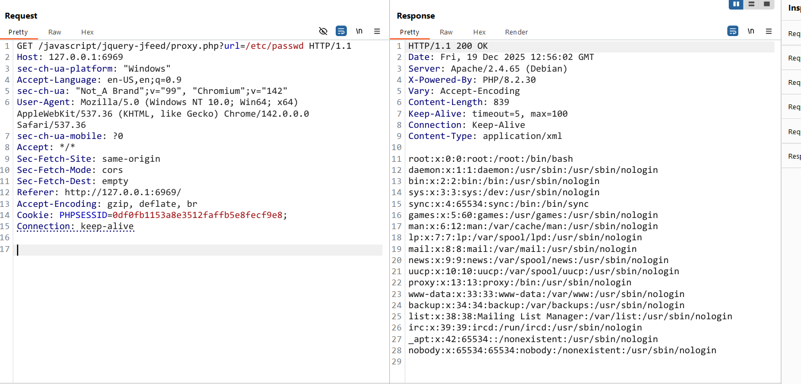
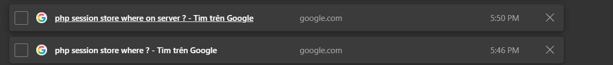
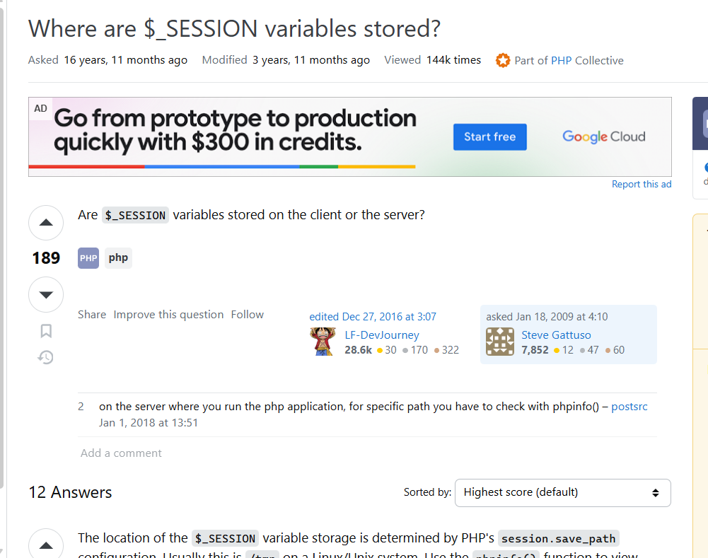
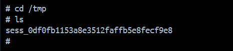
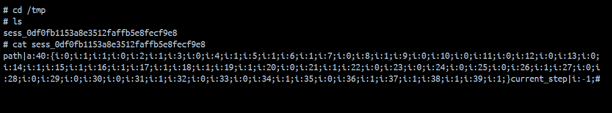
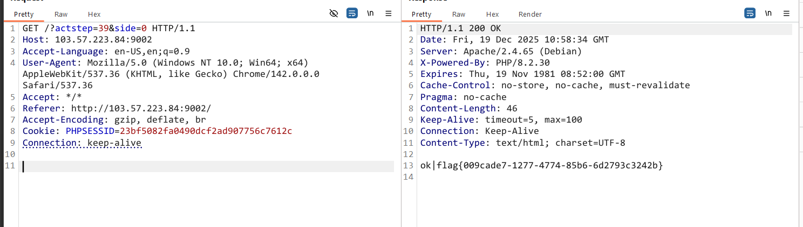

# Squid game
## Analyse
- Trước tiên thử build docker và truy cập giao diện web, ta thấy có vẻ như đây là 1 trò chơi mà người chơi ở mỗi lượt sẽ có 2 lựa chọn (ô bên trái hoặc phải), nếu chọn sai ô thì game sẽ bị reset.
 
- Tiếp theo ta đọc qua mã nguồn của challenge.
- File `index.php`
```php
<?php
session_start();
$STEPS = 40;

function reset_game() {
    global $STEPS;
    $_SESSION['path'] = []; 
    $_SESSION['current_step'] = -1;
    for ($i = 0; $i < $STEPS; $i++) $_SESSION['path'][] = random_int(0, 1);
}

if (isset($_GET['act'])) {
    if ($_GET['act'] === 'respawn') {
        reset_game();
        echo 'ok';
        exit;
    }

    if ($_GET['act'] === 'move') {
        $step = intval($_GET['step']);
        $side = intval($_GET['side']);
        
        if (!isset($_SESSION['current_step'])) $_SESSION['current_step'] = -1;
        
        if ($step !== $_SESSION['current_step'] + 1) die('err_seq');
        
        if ($step < 0 || $step >= $STEPS) die('err');
        
        if ($_SESSION['path'][$step] === $side) {
            $_SESSION['current_step'] = $step;
            echo 'ok';
            if ($step === $STEPS - 1) echo '|' . shell_exec('cat /flag-*');
        } else {
            reset_game();
            echo 'dead';
        }
        exit;
    }
}
?>
### Đoạn còn lại là template HTML
```
- Logic ở đây khá rõ ràng, trước tiên ta phân tích hàm reset_game:
```php
function reset_game() {
    global $STEPS;
    $_SESSION['path'] = []; 
    $_SESSION['current_step'] = -1;
    for ($i = 0; $i < $STEPS; $i++) $_SESSION['path'][] = random_int(0, 1);
}
```
- Khi `reset_game` được kích hoạt, nó tạo một mảng rỗng `$_SESSION['path']` , sau đó khởi tạo ngẫu nhiên các giá trị 0 hoặc 1 vào vị trí từ index 0 đến 39. Giá trị `$_SESSION['path'][$i]` chính là ô đúng của bước đi thứ i (0 là ô bên trái, 1 là ô bên phải). Và vị trí ban đầu (current_step) của chúng ta được set là -1 (` $_SESSION['current_step'] = -1 `).
- Tiếp theo đến phần chính của game :
```php
if (isset($_GET['act'])) {
    if ($_GET['act'] === 'respawn') {
        reset_game();
        echo 'ok';
        exit;
    }

    if ($_GET['act'] === 'move') {
        $step = intval($_GET['step']);
        $side = intval($_GET['side']);
        
        if (!isset($_SESSION['current_step'])) $_SESSION['current_step'] = -1;
        
        if ($step !== $_SESSION['current_step'] + 1) die('err_seq');
        
        if ($step < 0 || $step >= $STEPS) die('err');
        
        if ($_SESSION['path'][$step] === $side) {
            $_SESSION['current_step'] = $step;
            echo 'ok';
            if ($step === $STEPS - 1) echo '|' . shell_exec('cat /flag-*');
        } else {
            reset_game();
            echo 'dead';
        }
        exit;
    }
```
- Đầu tiên server lấy giá trị của tham số `act`:
    - Nếu `act` = `respawn` -> reset game.
    - Nếu `act` = `move` -> Lấy thêm 2 tham số là `step` (bước đi tiếp theo) và `side` (nhận giá trị `0` hoặc `1` tương ứng bên trái hoặc phải).
        - Sau đó là một số dòng code để validate 2 tham số vừa truyền vào, tất cả đều được xử lý khá chặt (dùng === thay vì == ). Và nếu đi đúng 40 lần liên tiếp thì ta sẽ nhận được flag.
- Nhận xét : Lúc đầu mình nghĩ là sẽ có 1 lỗi logic ở đâu đó giúp ta bypass và nhận được flag, nhưng sau 1 thời gian dài không tìm thấy manh mối, mình bắt đầu kiểm tra các file còn lại.
    - `style.css` : là 1 file css bình thường, cũng không có gì thú vị.
    - `game.js` : Liên quan đến xử lý game ở phía client, cũng không có gì đáng ngờ.
    - `Dockerfile`: 
```dockerfile
FROM php:8.2-apache
RUN apt update && apt install libjs-jquery-jfeed -y

COPY src /var/www/html/

COPY flag.txt /flag.txt
RUN mv /flag.txt /flag-`cat /proc/sys/kernel/random/uuid`.txt

EXPOSE 80
```
- Khi mà ta thấy logic code quá chặt, thứ tiếp theo nên kiểm tra chính là các dependencies, thư viện được cài đặt. Ở đây ta thấy `libjs-jquery-jfeed` được cài đặt, nhưng khi kiểm tra kĩ lại trong source code thì lại thấy nó không hề được sử dụng, khá là đáng ngờ. Ta thử google tìm `libjs-jquery-jfeed` :
 
(phải đến tận trang thứ 3 mới xuất hiện một nguồn có khả năng cao sẽ hữu dụng, lúc đầu mình cũng chỉ tra đến trang số 1 là dừng nên chưa tìm ra, sau đấy thì ban tổ chức cũng có thêm hint là đường dẫn này).

- Đọc qua, ta thấy rằng mình có thể lợi dụng `libjs-jquery-jfeed` để khai thác lỗi `LFI` (lỗi đọc được file bất kỳ trên hệ thống).
- Ta thử đọc `/etc/passwd` trên challenge

- Vậy là đã thành công đọc được file bất kỳ, nhưng flag của chúng ta được tạo với dạng `flag-<chuỗi_ngẫu_nhiên>.txt` nên việc đọc luôn flag là bất khả thi.
```dockerfile
COPY flag.txt /flag.txt
RUN mv /flag.txt /flag-`cat /proc/sys/kernel/random/uuid`.txt
```
- Vậy tiếp theo chúng ta nên tận dụng lỗi `LFI` như thế nào để solve challenge? Lúc này mình nhớ rằng, còn một cách nữa để đọc được flag, đó chính là chọn đúng ô 40 lần liên tiếp. Vậy làm sao để chọn đúng? Do logic code rất chặt nên ta chỉ còn cách đi đúng từng bước, theo logic game chứ không thể đi đường tắt được. Mà như ta đã biết, đáp án cho mỗi bước đi được lưu ở `$_SESSION['path']`, và nó chắc chắn phải được lưu ở trên server. Lúc đấy mình đặt ra một câu hỏi : "Nếu nội dung của $_SESSION được lưu trên server, vậy nó sẽ được lưu ở path nào?" -> Mình tra google thử :



- Ngay sau khi có gợi ý, mình mở docker lên và xem thử `/tmp` :

- Ở đây mình thấy có file tên `sess_0df0fb1153a8e3512faffb5e8fecf9e8` được tạo. Dễ nhận thấy file này tương ứng với `PHPSESSID` = `0df0fb1153a8e3512faffb5e8fecf9e8` . Thử xem nội dung của file.

- Đúng như mong đợi từ trước, file này chứa thông tin về các nước đi đúng tương ứng với `PHPSESSID` = `0df0fb1153a8e3512faffb5e8fecf9e8` . Tiếp theo chúng ta chỉ việc gửi request từng bước đi tương ứng với thông tin đã có là xong.

## Solution
- B1: reset game, lấy `PHPSESSID` 
- B2: Tận dụng lỗi `LFI` đã được khai thác để đọc file session tương ứng được lưu trên server
- B3: Gửi request theo đáp án đã có (từng bước từ 0 -> 39)
-> Flag

